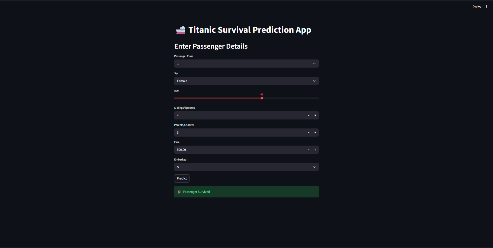

# 🚢 Titanic Survival Prediction | End-to-End Machine Learning Project

## 📌 Project Overview

This project predicts whether a passenger would survive the Titanic disaster based on passenger details such as age, gender, ticket class, fare, family members, and embarkation port.

It is a complete **end-to-end Machine Learning project** covering:

* Data Cleaning & Preprocessing
* Exploratory Data Analysis (EDA)
* Feature Engineering
* Model Building
* Model Evaluation
* Streamlit Web App Deployment

The final model was built using **Random Forest Classifier** and achieved approximately **83% accuracy**.

---

## 🎯 Problem Statement

The Titanic disaster is one of the most well-known tragedies in history.
Using passenger data, the objective is to build a classification model that predicts:

* **0 = Did Not Survive**
* **1 = Survived**

This is a **Binary Classification Problem**.

---

## 📂 Dataset Information

The dataset contains passenger details such as:

* Passenger Class (`Pclass`)
* Gender (`Sex`)
* Age
* Fare
* Number of Siblings/Spouses (`SibSp`)
* Number of Parents/Children (`Parch`)
* Embarked Port
* Survival Status (`Survived`)

Dataset Source: Titanic Dataset (publicly available)

---

## 🛠️ Technologies Used

* Python
* Pandas
* NumPy
* Matplotlib
* Seaborn
* Scikit-learn
* XGBoost
* Streamlit
* Pickle

---

## 🔍 Exploratory Data Analysis (EDA)

Performed detailed analysis to understand passenger survival patterns.

### Key Insights:

### ✅ Gender Impact

Female passengers had significantly higher survival chances compared to male passengers.

### ✅ Passenger Class Impact

Passengers in **1st Class** had higher survival rates than those in **3rd Class**.

### ✅ Fare Impact

Passengers paying higher fares had better survival probability.

### ✅ Family Impact

Passengers traveling with moderate family size had better survival chances.

---

## ⚙️ Data Preprocessing

Handled missing values:

* `Age` filled using median
* `Embarked` filled using mode
* `Cabin` dropped due to excessive missing values

Converted categorical features:

* Gender encoded into numeric values
* Embarked column one-hot encoded

---

## 🧠 Feature Engineering

Created new useful features:

### FamilySize

```python
FamilySize = SibSp + Parch + 1
```

### IsAlone

```python
1 = Alone
0 = With Family
```

These engineered features improved model performance.

---

## 🤖 Models Trained

The following models were tested:

* Logistic Regression
* Random Forest Classifier
* XGBoost Classifier

### Final Selected Model:

✅ Random Forest Classifier

Reason:

* Better accuracy
* Stable performance
* Strong feature importance interpretation

---

## 📈 Model Performance

### Final Accuracy:

**~83%**

### Additional Evaluation:

* Cross Validation Accuracy: ~81%
* Precision / Recall Checked
* Confusion Matrix Evaluated

---

## 🔥 Important Features

Based on feature importance:

1. Gender
2. Fare
3. Passenger Class
4. Age

These were the strongest predictors of survival.

---

## 🌐 Streamlit Web Application

An interactive web app was built where users can enter passenger details and predict survival instantly.

### Features:

* User-friendly interface
* Live prediction
* Clean UI
* Instant output

Run locally:

```bash
streamlit run app.py
```

---

## 📁 Project Structure

```bash
Titanic-Survival-Prediction/
│── app.py
│── model.pkl
│── Titanic_Project.ipynb
│── requirements.txt
│── README.md
│── screenshots/
```

---

## ▶️ How to Run This Project

### 1️⃣ Clone Repository

```bash
git clone <your-repo-link>
cd Titanic-Survival-Prediction
```

### 2️⃣ Install Requirements

```bash
pip install -r requirements.txt
```

### 3️⃣ Run Streamlit App

```bash
streamlit run app.py
```

---

## 📸 Screenshots



Examples:

* EDA graphs
* App UI
* Prediction output

---

## 💼 Resume Value

This project demonstrates:

* Data Cleaning Skills
* Feature Engineering Skills
* Classification Algorithms
* Model Evaluation
* Deployment Knowledge
* End-to-End ML Workflow

---

## 🚀 Future Improvements

* Hyperparameter tuning with GridSearchCV
* Better UI styling
* Deployment on Streamlit Cloud
* Add probability score prediction
* Docker containerization

---

## 👨‍💻 Author

**Pranay**

---

## ⭐ If You Like This Project

Please star the repository and share feedback.

---
